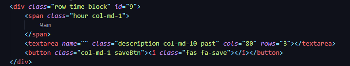
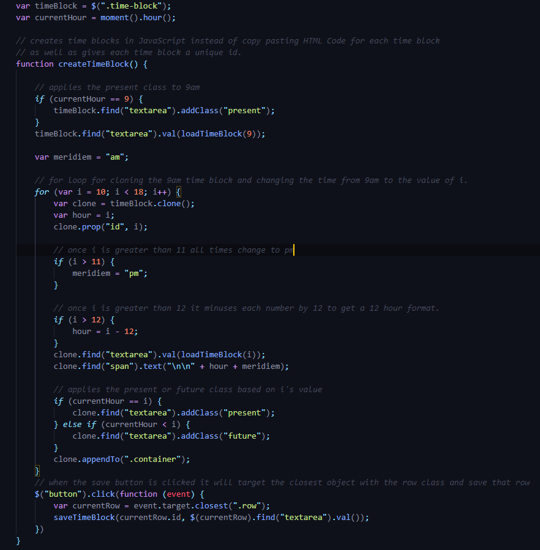
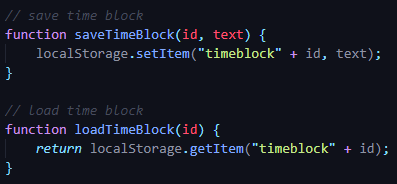

# work-day-scheduler

## HTML
### Added one time block in html and gave it an id of '9'

## JS
### Cloned the time block in the html and  used a for loop to create the other 8 time blocks
### Gave each time block a unique id of the time it is set to using the same for loop I used to clone them
### If i == 12+ it would change the 'am' to 'pm'
### If i == 13+ it would change the time format to 12 hour

### Added saving and loading via localstorage

